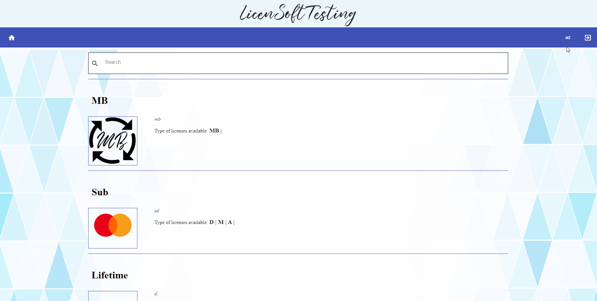
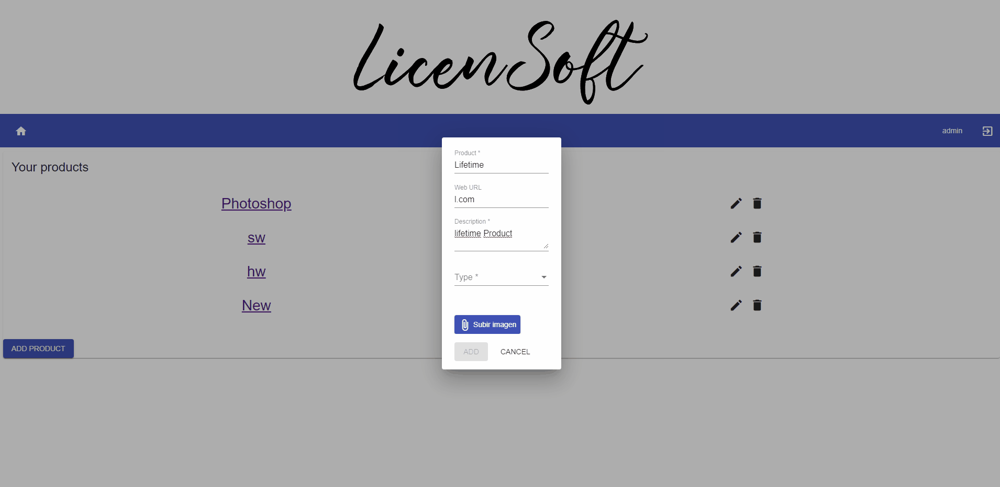
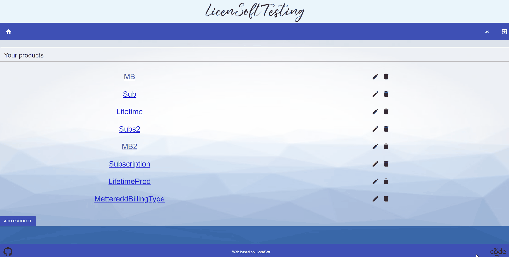
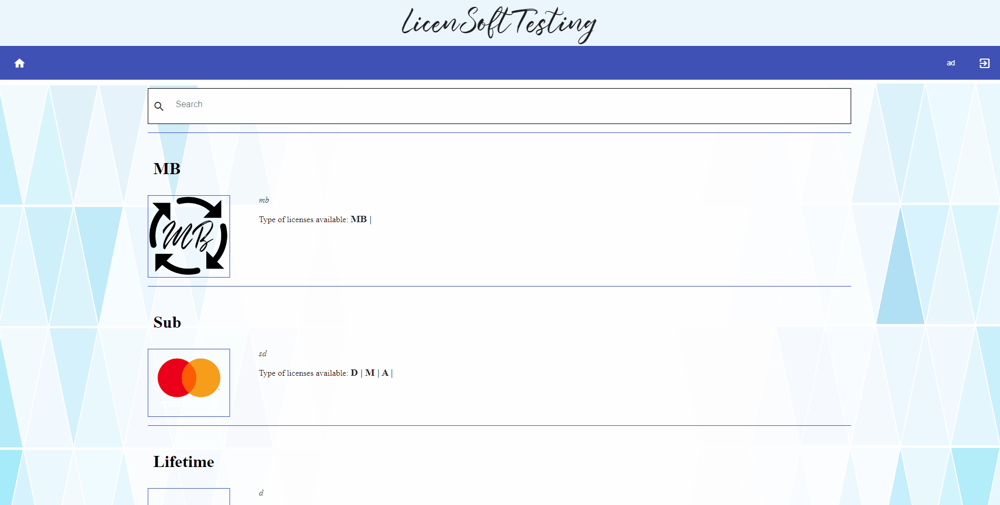
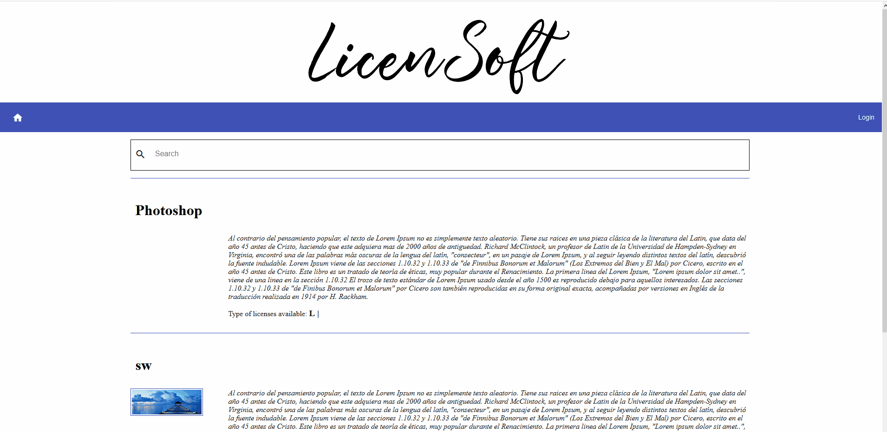
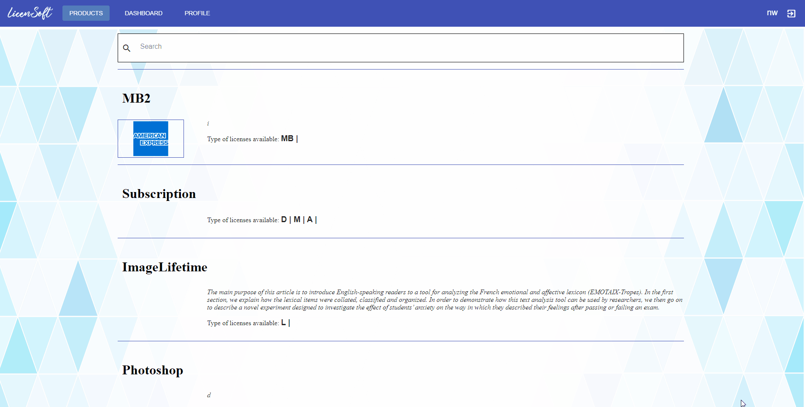
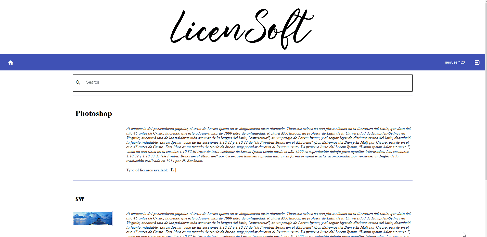
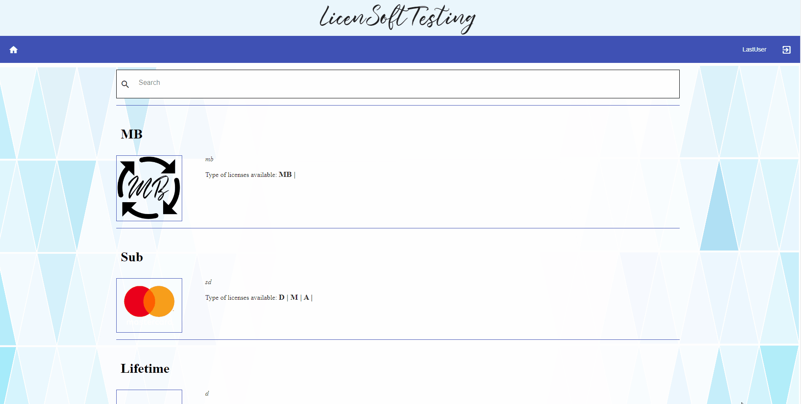
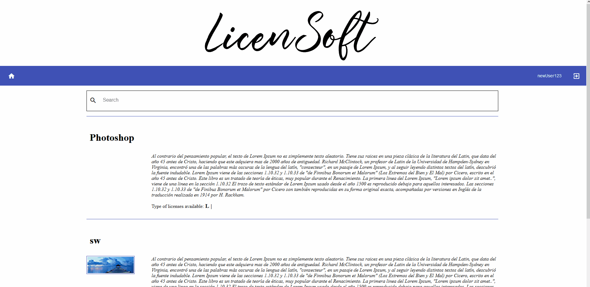
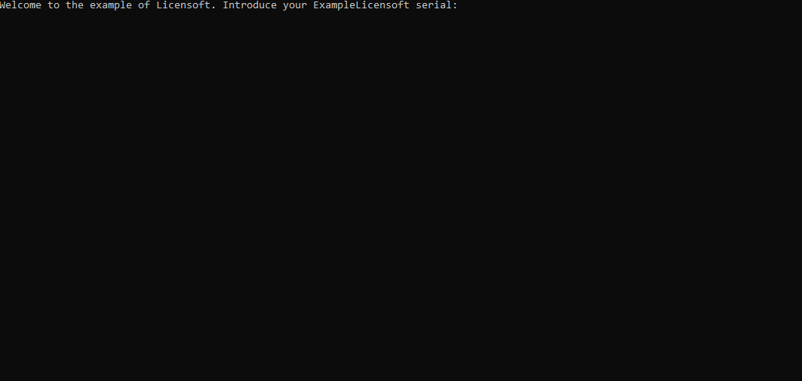

# What's Licensoft?
Licensoft is an OpenSource online platform to allow software developers and software companies to manage paid licenses of their software. 
With Licensoft it will be easy to charge for a software: run the web where the customers will buy the licenses and use the Licencheck library in your software to check for the validity of the licenses that users introduce.

## INDEX
* [Roles](#roles)
* [Domain](#domain)
    * [Product](#product)
    * [License](#license)
	* [LicenseSubscription](#license-subscription)
    * [LicenseStatistics](#license-statistics)
    * [User](#user)
	* [UsedCard](#used-card)
* [ADMIN Habilities](#admin-habilities)
    * [Add Product - Subscription](#add-product-subs) 
    * [Add Product - Lifetime](#add-product-lifetime)
    * [Add Product - Mettered Billing](#add-product-mb)
    * [Edit Product](#edit-product)
    * [Delete Product](#delete-product)
* [USER normal flow](#user-normal-flow)
	1. [Register](#register)
	2. [Login](#login)
	3. [Attach payment source to user](#attach-payment-source-to-user)
	4. [Search in catalog](#search-in-catalog)
	5. [Subscribe to Product](#subscribe-to-product)
    6. [Subscribe to a Free Trial](#subscribe-to-a-free-trial)
	7. [Buy Lifetime Product](#buy-lifetime-product)
	8. [Introduce license Serial into purchased software ](#introduce-license-serial-into-the-purchased-software)
* [Other Docs](#other-documentation)


 


## ROLES
In Licensoft there are 2 types of roles: **ADMIN** and **USER**. 
	**ADMIN** will be the Software seller. The main diference between them is that ADMIN can   
```Add/Edit/Delete Products (name, description, prices...). ```

## DOMAIN
### Product
* Name (String)
* Description (String)
* WebLink (String)
* Licenses  (License[])
* TypeSubs (String[]) 
* PhotoAvailable (boolean)
* PlansPrices (Map<String, Number>)
* Sku (String)
* Active (boolean)
* ProductStripeId (String)
* TrialDays (int)

### License
* Serial (String)
* Active (boolean)
* Type (String)
* Product [(Product)](README.md#product)
* StartDate (Date)
* Owner (String)
* Price (double)

### License Subscription
* Trial (boolean)
* CancelAtEnd (boolean)
* SubscriptionItemId (String)
* SubscriptionId (String)
* NUsage (int)
* EndDate (Date)

### License Statistics
Object with statistics of a License (by ip)
* License (License)
* Ip (String)
* NUsage (int)
* LastUsage (Date)


### User
* Name (String)
* Roles (String[])
* Password (String - hashed)
* UserStripeId (String)

### Used Card
*	Last4 (int)
*	ExpMonth (int)
*	ExpYear (int)
*	ProductName (int)

## ADMIN Habilities
### Add Product - Subscription type <a name="add-product-subs"></a>


---

### Add Product - Lifetime type <a name="add-product-lifetime"></a>
This flow is the same as Adding a subscription type but changing its type.



---

### Add Product - Mettered Billing(Subscription) type <a name="add-product-mb"></a>
This flow is the same as Adding a subscription type (MB is a type of Subscription).


---

### Edit Product
Admin can change URL and description of a Product. To edit other parameters admin should add a new product.


---

### Delete Product
The delete will set the product to inactive and it will disappear from the catalog, but active licenses of it will still be active.


---
---

## USER normal Flow
### Register


---

### Login


---

### Attach payment source to User


---

### Search in catalog


---

### Subscribe to Product


---

### Subscribe to a Free Trial


---

### Buy Lifetime Product


---

### Introduce license Serial into the purchased software 


---
---


## OTHER DOCUMENTATION
* [Stripe Integration](docs/StripeIntegration.md)
* [Licencheck Guide](docs/LicencheckGuide.md)
* [API](docs/API.md)
* [Installation Guide](docs/INSTALLATION_GUIDE.md)