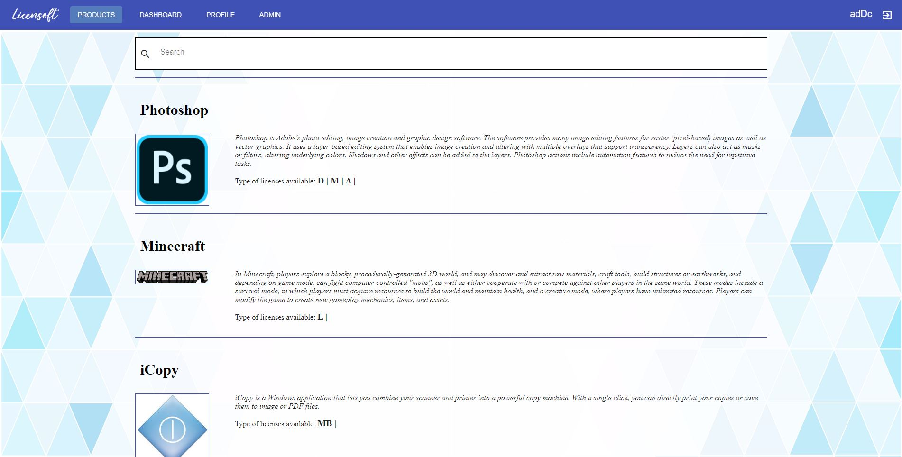

**TRAVIS** [](https://travis-ci.com/github/codeurjc-students/2019-LicenseManager)

**SONAR FRONTEND** [](https://sonarcloud.io/dashboard?id=codeurjc-students_2019-LicenseManager)

**SONAR BACKEND** [](https://sonarcloud.io/dashboard?id=KikeAjani_LicenBack)

# What's Licensoft?
Licensoft is an OpenSource online platform to allow software developers and software companies to manage paid licenses of their software. 

We offer 2 services that work together:
- **1:** A web-application for the sale and manage of software licenses.
- **2:** A Java library to check the validity of the licenses bought in the web-application, called Licencheck.

These two pieces conform Licensoft and will make easy to charge for a software: run the web where the customers will buy the licenses and use the Licencheck library in your software to check for the validity of the licenses that users introduce.


### Forget about Payment Systems 
Licensoft will take care of the entire payment system through connections with **Stripe**. 
It will only be necesary to create a Stripe account and link it to the web-application through Stripe **API keys**.
More info about Stripe Integration with Licensoft it's available in the [following link](docs/StripeIntegration.md).


## A look at the web application<a name="look-web-application"></a>
The web frontend has been build with Angular Material components and styles. It presents a simple interface which allows users to buy and manage their licenses, and sellers to customize their products to sell.
An official User demo is available here: [http://www.licensoft.es](http://www.licensoft.es)




## Why use Licensoft?
Licensoft has been developed to help software crafters to sell their products without as easy as posible, without dependencies and troubles. 
Licensoft 3 main pillars are:
 - **Open Source**: This platform has been developed by and for the software developers. All the code is available for its usage, modification, extension or error solving.
 - **Decoupling**: The web-application offers a license management platform completely separate of the software that wants to be selled, with a lot of customization options for products when selling. 
 The software that is wanted to be sold will include just a few calls to the Licencheck library (see [Licencheck quick look](#check-validity-licenses))
- **Simplicity**: Thanks to the second pillar, Licensoft allows software developers to have an easy integration web-software_to_sell. Running the web in their desired domain and including the calls to Licencheck inside their software will be the only steps to do to have Licensoft working.


## Quick Look to Licenses
The strength of this project are the Licenses. So first, let's see how many types of Licenses we offer and their peculiarities.

| Name | Pseudonym| Duration | Renewal | Trial | Initial Payment | Fixed Price | Online Mode | Offline Mode
| -- | --| --| --| -- | -- | -- | -- | --
| **Lifetime** | L | Forever|-| - | :heavy_check_mark: | :heavy_check_mark: | :heavy_check_mark: | :heavy_check_mark:
| **Daily Subscription** | D | 24h|:heavy_check_mark:|**0 - X*** days | :heavy_check_mark: | :heavy_check_mark:| :heavy_check_mark: | :heavy_check_mark:
| **Monthly Subscription** | M | One month|:heavy_check_mark:|**0 - X*** days |:heavy_check_mark:| :heavy_check_mark:| :heavy_check_mark: | :heavy_check_mark:
| **Annual Subscription** | A | One year|:heavy_check_mark:| **0 - X*** days| :heavy_check_mark:| :heavy_check_mark:| :heavy_check_mark: | :heavy_check_mark:
| **Pay per Use Subscription** | MB | One month |:heavy_check_mark:| :x:| :x: | :x:  | :heavy_check_mark: | :x:

These Licenses can be delivered to the customers to *unlock* the software in two forms:
- **Online mode (Serial)**: All License types can have this form.
- **Offline mode (License File)**: All License types **except MB (Pay per Use)** can have this form.

Software **sellers** will be able to decide if their products have Online Licenses, Offline Licenses or both (except MB = Online) .
**Users** will be always able to get their Licenses by entering to their User Dashboard of the web-application and copying or downloading them.

### Checking validity of the Licenses<a name="check-validity-licenses"></a>
As said before, Licenses will be checked depending on which mode (Online, Offline or Both) the sellers have configured them. This work will be carried out by the Java Library **Licencheck**, which is prepared to do the checking in both modes, depending how it is instantiated for future calls.

The Licencheck use is as easy as instatiating Licencheck and doing a simple call inside the software you want to sell:
```
Licencheck l = new Licencheck("http://mylicensoftwebpage.com",false);

l.checkLicense("ebc2d716-d666-4eef-8e3d-50c435e1d3e4","productName")
```


For more information about Licencheck (**HOW to start using it,  methods EXPLANATION on detail, etc**), check the  [Licencheck Guide](docs/LicencheckGuide.md).


## Demo : LicencheckExample
We offer in this repo a basic Java application to check how works Licensoft in practice. 
LicencheckExample is a CLI application that generates random numbers  between 0 and a given number. But the interesting of this application is the initial license checking (in this case, online). 
To get this app running, a License of LicecheckExample must be bought in [licensoft.es](http://licensoft.es) (Test card: 4242 4242 4242 4242 , 02/30 , cvc = 222222). 
 When bought, the user must introduce on LicencheckExample the serial of the license. If valid, it will be allowed to start with the random number generator app.


## DOCUMENTATION
### USER
* [Installation Guide-Production](docs/INSTALLATION_GUIDE.md)
* [Licensoft-Web in Details](docs/LicensoftDetailed.md)
* [Licencheck Guide](docs/LicencheckGuide.md)

### DEVELOPER
* [Development Guide](docs/DevelopmentGuide.md)
* [Stripe Integration](docs/StripeIntegration.md)
* [API](http://licensoft.es/swagger-ui.html)

