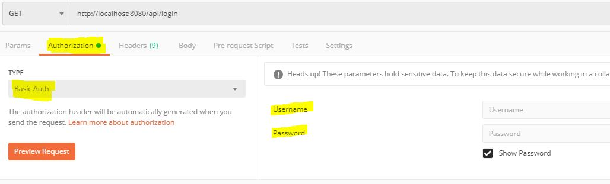

# Licensoft-Web API
This document will explain how is used the Licensoft-Web API.


## Index
* [LogIn](#login)
* [LogOut](#logout)
* [Register](#register)
* [Get All Users](#get-all-users)
* [Get All Cards from User](#get-all-cards-from-user)
* [Delete Card of User](#delete-card-of-user)
* [Add Card](#add-card)
* [Set Default Card](#set-default-card)
* [Get Default Card](#get-default-card)
* [Check Used Card](#check-used-card)
* [Add Used Card](#add-used-card)
* [Add Trial Subscription](#add-trial-subscription)
* [Add Subscription](#add-subscription)
* [Buy Product](#buy-product)
* [Get Products](#get-products)
* [Get Specific Product](#get-specific-product)
* [Post Product](#post-product)
* [Edit  Product](#edit-product)
* [Delete Product](#delete-product)
* [Post image (on a Product)](#postImage)
* [Get image (of a Product)](#getImage)  
* [Get Licenses of Product](#get-licenses-of-product)
* [Get License by Product and Serial](#getLicSerialProduct)
* [Get Licenses of User](#get-licenses-of-user)
* [Set cancelAtEnd of License](#set-cancelatend-of-license)
* [Get Licenses of User and Product](#getLicUserProduct)
* [Check License (Licencheck)](#checkLicense)
* [Get Stripe Public ApiKey](#get-stripe-public-apikey)
* [Get App Name](#get-app-name)


## Authorization
Many of the requests will need Basic Authentication (with role USER or ADMIN) . If not, will respond with code 401 or 403.
Example: Postman


## Login
Make the request without params, just including in Authorization UserName and Password.
- **URL**  
   `/api/logIn`
- **Method**  
   `GET`
- **Data Params**

- **Required role**:  
   None
   
- **Authorization:**
	Basic Auth 
 

- **Success Response**
  - **Code**: 200 OK
  - **Content**:
   ```json
	{
	    "id": 15,
	    "name": "pepe",
	    "email": "pepe@gmail.com",
	    "roles": [
	        "ROLE_USER"
	    ]
	}

## LogOut
- **URL**  
   `/api/logOut`
- **Method**  
   `GET`
- **Data Params**

- **Required role**:  
   None
   
- **Authorization:**
	Basic Auth 
 

- **Success Response**
  - **Code**: 200 OK
  - **Content**:  `true`

## Register
An account will be created and and email will be sent to the user with the credentials.
- **URL**  
   `/api/register/{userName}/{pass}/{pass2}/{email}`
- **Method**  
   `POST`
- **Data Params**
Path Variables:
	* String userName
	* String pass
	* String pass2 (must be the same as pass) 
	* String email
- **Required role**:  
   None
   
- **Authorization:**
	None 

- **Success Response**
  - **Code**: 200 OK
  - **Content**:
    ```json
	{
	    "id": 15,
	    "name": "pepe",
	    "email": "pepe@gmail.com",
	    "roles": [
	        "ROLE_USER"
	    ]
	}
   
## Get All Users
- **URL**  
   `/api/users`
- **Method**  
   `GET`
- **Data Params**

- **Required role**:  
   Admin.
   
- **Authorization:**
	Basic Auth 
 

- **Success Response**
  - **Code**: 200 OK
  - **Content**:

  ```json
  {
    "content": [
        {
            "id": 1,
            "name": "ad",
            "email": "ad@email.com",
            "roles": [
                "ROLE_USER",
                "ROLE_ADMIN"
            ]
        },
        {
            "id": 15,
            "name": "pepe",
            "email": "pepe@gmail.com",
            "roles": [
                "ROLE_USER"
            ]
        }
    ],
    "pageable": {
        "sort": {
            "sorted": false,
            "unsorted": true,
            "empty": true
        },
        "offset": 0,
        "pageNumber": 0,
        "pageSize": 20,
        "paged": true,
        "unpaged": false
    },
    "last": true,
    "totalElements": 2,
    "totalPages": 1,
    "size": 20,
    "number": 0,
    "sort": {
        "sorted": false,
        "unsorted": true,
        "empty": true
    },
    "numberOfElements": 2,
    "first": true,
    "empty": false
}

## Get All Cards from User
- **URL**  
   `/api/users/cards`
- **Method**  
   `GET`
- **Data Params**
Path Variables:
	* String userName => User owner of the card
    
- **Required role**:  
    * User
   
- **Authorization:**
	Basic Auth 

- **Success Response**
  - **Code**: 200 OK
  - **Content**:
  ```json
	[
	    {
	        "lastResponse": null,
	        "rawJsonObject": null,
	        "billingDetails": {
	            "lastResponse": null,
	            "rawJsonObject": null,
	            "address": {
	                "lastResponse": null,
	                "rawJsonObject": null,
	                "city": null,
	                "country": null,
	                "line1": null,
	                "line2": null,
	                "postalCode": "42424",
	                "state": null
	            },
	            "email": null,
	            "name": null,
	            "phone": null
	        },
	        "card": {
	            "lastResponse": null,
	            "rawJsonObject": null,
	            "brand": "visa",
	            "checks": {
	                "lastResponse": null,
	                "rawJsonObject": null,
	                "addressLine1Check": null,
	                "addressPostalCodeCheck": "pass",
	                "cvcCheck": "pass"
	            },
	            "country": "US",
	            "description": null,
	            "expMonth": 4,
	            "expYear": 2024,
	            "fingerprint": "uR9MdOWgbKM65BlE",
	            "funding": "credit",
	            "iin": null,
	            "issuer": null,
	            "last4": "4242",
	            "threeDSecureUsage": {
	                "lastResponse": null,
	                "rawJsonObject": null,
	                "supported": true
	            },
	            "wallet": null
	        },
	        "cardPresent": null,
	        "created": 1583774621,
	        "customer": "cus_GsaOHY27HW7goa",
	        "id": "pm_1GKpKLJogRBbRU8ObkkCSFA5",
	        "ideal": null,
	        "livemode": false,
	        "metadata": {},
	        "object": "payment_method",
	        "sepaDebit": null,
	        "type": "card",
	        "customerObject": null
	    }
	]

## Delete Card of User
- **URL**  
   `/api/users/{userName}/card/{paymentCardId}`
- **Method**  
   `DELETE`
- **Data Params**
Path Variables:
	* String paymentCardId=> Stripe's identifier of the card
	* String userName => User owner of the card
- **Required role**:  
    * User
   
- **Authorization:**
	Basic Auth 

- **Success Response**
  - **Code**: 200 OK
   ```json
	{
		"response": "true"
	}

## Add Card
- **URL**  
   `/api/users/{userName}/addCard/{paymentCardId}`
- **Method**  
   `POST`
- **Data Params**
Path Variables:
	* String paymentCardId=> Stripe's identifier of the card
	* String userName => User owner of the card

- **Required role**:  
    * Admin
    * User
   
- **Authorization:**
	Basic Auth 

- **Success Response**
  - **Code**: 200 OK
  - **Content**:
  ```json
	{
		"response": "pm_1GL5R9JogRBbRU8OEMcORafb"
	}

## Set Default Card
- **URL**  
   `/api/users/{userName}/default-card/{paymentCardId}`
- **Method**  
   `PUT`
- **Data Params**
Path Variables:
	* String paymentCardId=> Stripe's identifier of the card
	* String userName => User owner of the card

- **Required role**:  
    * Admin
    * User
   
- **Authorization:**
	Basic Auth 

- **Success Response**
  - **Code**: 200 OK
  - **Content**: `true`

## Get Default Card
- **URL**  
   `/api/users/{userName}/default-card`
- **Method**  
   `GET`
- **Data Params**
Path Variables:
	* String userName => User owner of the card

- **Required role**:  
    * Admin
    * User
   
- **Authorization:**
	Basic Auth 

- **Success Response**
  - **Code**: 200 OK
  - **Content**:
  ```json
	{
		"response": "pm_1GL5R9JogRBbRU8OEMcORafb"
	}
##  Check Used Card 
This method will check if a card has already been used to subscribe to a Trial Period of a Product.
- **URL**  
   `/api/checkUsed/{last4}/{expMonth}/{expYear}/product/{productName}`
- **Method**  
   `GET`
- **Data Params**
Path Variables:
	* int last4
	* int expMonth
	* int expYear
	* String productName
- **Required role**:  
    * Admin
    * User
   
- **Authorization:**
	Basic Auth 

- **Success Response**
  - **Code**: 200 OK
  - **Content**: `true`

##  Add Used Card 
This method will add a card used to subscribe to a Trial-Period of a Product to the database to avoid users to use it again.
- **URL**  
   `/api/{last4}/{expMonth}/{expYear}/product/{productName}`
- **Method**  
   `GET`
- **Data Params**
Path Variables:
	* int last4
	* int expMonth
	* int expYear
	* String productName
- **Required role**:  
    * Admin
    * User
   
- **Authorization:**
	Basic Auth 

- **Success Response**
  - **Code**: 200 OK
  - **Content**:
  ```json
	 {
		"last4": 4242,
		"expMonth": 3,
		"expYear": 21,
		"productName": "Sub"
	}

##  Add Trial Subscription
The user will be subscribed to a Trial-period subscription (type "M": monthly). By default, the subscription will be automatically renewed when trial period ends.
- **URL**  
   `/api/users/{userName}/products/{productName}/addTrial/cards/{tokenId}`
- **Method**  
   `PUT`
- **Data Params**
Path Variables:
	* String productName
	* String userName (User that is going to subscribe)
	* String TokenId => Token that identifies the card that is going to be used to check if it is the first time the user subscribes to a free trial (autogenerated by Stripe Elements) 
- **Required role**:  
    * Admin
    * User
   
- **Authorization:**
	Basic Auth 

- **Success Response**
  - **Code**: 200 OK
  - **Content**:
  ```json
	{
	    "id": null,
	    "serial": "12a9f1e6-54f0-4070-869b-696b2a984aeb",
	    "active": true,
	    "type": "M",
	    "product": {
	        "name": "Sub",
	        "productStripeId": "prod_GsrgYFmJoUHoSR",
	        "typeSubs": [
	            "D",
	            "M",
	            "A"
	        ],
	        "description": "sd",
	        "webLink": "sd",
	        "photoAvailable": false,
	        "photoSrc": "",
	        "plansPrices": {
	            "A": 233.0,
	            "D": 1.0,
	            "M": 23.0
	        },
	        "sku": null,
	        "active": true,
	        "trialDays": 12
	    },
	    "startDate": "2020-03-10T11:13:51.333+0000",
	    "owner": "pepe",
	    "price": 23.0,
	    "licenseStats": null,
	    "trial": true,
	    "cancelAtEnd": false,
	    "subscriptionItemId": "si_GsrllU2Cmi9k4G",
	    "subscriptionId": "sub_GsrljRRfIKJ4dK",
	    "nUsage": 0,
	    "endDate": "2020-03-22T11:13:51.333+0000"
	}

    
##  Add Subscription
- **URL**  
   `/api/users/{userName}/products/{productName}/{typeSubs}/addSubscription/renewal/{automaticRenewal}`
- **Method**  
   `PUT`
- **Data Params**
Path Variables:
	* String productName
	* String typeSubs (D,M,A,L)
	* String userName (User that is going to subscribe)
	* boolean automaticRenewal 
- **Required role**:  
    * Admin
    * User
   
- **Authorization:**
	Basic Auth 

- **Success Response**
  - **Code**: 200 OK
  - **Content**:
  ```json
	{
	    "id": null,
	    "serial": "7672b993-21d9-4c62-a25e-0fb18d2b2b3e",
	    "active": true,
	    "type": "D",
	    "product": {
	        "name": "Sub",
	        "productStripeId": "prod_GsrgYFmJoUHoSR",
	        "typeSubs": [
	            "D",
	            "M",
	            "A"
	        ],
	        "description": "sd",
	        "webLink": "sd",
	        "photoAvailable": false,
	        "photoSrc": "",
	        "plansPrices": {
	            "A": 233.0,
	            "D": 1.0,
	            "M": 23.0
	        },
	        "sku": null,
	        "active": true,
	        "trialDays": 12
	    },
	    "startDate": "2020-03-10T11:28:24.188+0000",
	    "owner": "pepe",
	    "price": 1.0,
	    "licenseStats": null,
	    "trial": false,
	    "cancelAtEnd": true,
	    "subscriptionItemId": "si_Gsrzjz70ptFZNc",
	    "subscriptionId": "sub_GsrzY9fgseBg6O",
	    "nUsage": 0,
	    "endDate": "2020-03-11T11:28:24.188+0000"
	}

## Buy Product
This functionality is divided in two steps:
		1.  Create Stripe's PaymentIntent.
		2. Confirm the Stripe's PaymentIntent created before.
### Create Stripe's PaymentIntent
Returns the paymentIntent, needed to confirm it later.
- **URL**  
   `/api/users/{userName}/paymentIntent/{tokenId}`
- **Method**  
   `PUT`
- **Data Params**
	* String userName (User that is going to buy the product)
	* String token ( Token of Card Info created with StripeElements on the frontend)
- **Data body**
	* Product product
- **Required role**:  
    * Admin
    * User
   
- **Authorization:**
	Basic Auth 
 

- **Success Response**
  - **Code**: 200 OK
  - **Content**:
  ```json
	{
	  "amount": 1200,
	  "amount_capturable": 0,
	  "amount_received": 0,
	  "application": null,
	  "application_fee_amount": null,
	  "canceled_at": null,
	  "cancellation_reason": null,
	  "capture_method": "automatic",
	  "charges": {
	    "object": "list",
	    "data": [],
	    "has_more": false,
	    "url": "/v1/charges?payment_intent\u003dpi_1GL6Z6JogRBbRU8OthkdLnv4",
	    "count": null,
	    "total_count": 0,
	    "request_options": null,
	    "request_params": null
	  },
	  "client_secret": "pi_1GL6Z6JogRBbRU8OthkdLnv4_secret_wgCAgjWwe0TURqwlBMheAsIvh",
	  "confirmation_method": "automatic",
	  "created": 1583840884,
	  "currency": "eur",
	  "customer": "cus_GsaOHY27HW7goa",
	  "description": "d",
	  "id": "pi_1GL6Z6JogRBbRU8OthkdLnv4",
	  "invoice": null,
	  "last_payment_error": null,
	  "livemode": false,
	  "metadata": {},
	  "next_action": null,
	  "object": "payment_intent",
	  "on_behalf_of": null,
	  "payment_method": "pm_1GL6Z5JogRBbRU8Ojt19mMXq",
	  "payment_method_options": {
	    "card": {
	      "installments": null,
	      "request_three_d_secure": "automatic"
	    }
	  },
	  "payment_method_types": [
	    "card"
	  ],
	  "receipt_email": "ad@email.com",
	  "review": null,
	  "setup_future_usage": null,
	  "shipping": null,
	  "source": null,
	  "statement_descriptor": null,
	  "statement_descriptor_suffix": null,
	  "status": "requires_confirmation",
	  "transfer_data": null,
	  "transfer_group": null
	}
### Confirm the Stripe's PaymentIntent
- **URL**  
   `/api/users/{userName}/confirm/{id}/products/{productName}`
   
- **Method**  
   `PUT`
- **Data Params**
	* String userName (User that is going to buy the product)
	* String id ( Id of the PaymentIntent created before)
	* String productName
- **Required role**:  
    * Admin
    * User
   
- **Authorization:**
	Basic Auth 
 

- **Success Response**
  - **Code**: 200 OK
  - **Content**:
  ```json
	{
	    "id": 20,
	    "serial": "3bb4cb84-0c59-46e1-8111-b6312190d6e6",
	    "active": true,
	    "type": "L",
	    "product": {
	        "name": "Lifetime",
	        "productStripeId": "prod_GssIew7sWmm035",
	        "typeSubs": [
	            "L"
	        ],
	        "description": "d",
	        "webLink": "df",
	        "photoAvailable": false,
	        "photoSrc": "",
	        "plansPrices": {
	            "L": 12.0
	        },
	        "sku": "sku_GssIHsDO1BCuxb",
	        "active": true,
	        "trialDays": 0
	    },
	    "startDate": "2020-03-10T11:52:57.417+0000",
	    "owner": "ad",
	    "price": 12.0,
	    "licenseStats": null
	}
## Get Products
- **URL**  
   `/api/products/all`
- **Method**  
   `GET`
- **Data Params**
	* *Optional* String search

- **Required role**:  
	None
   
- **Authorization:**
	None
 

- **Success Response**
  - **Code**: 200 OK
  - **Content**:
  ```json
  {
	"content": [
			{
			"name": "Photoshop",
			"productStripeId": "prod_Gfjc8kKSdjVwwp",
			"typeSubs": [
			"L"
			],
			"description": "...",
			"webLink": "www.photoshop.com",
			"photoAvailable": false,
			"photoSrc": "",
			"plansPrices": {
			"L": 1500.0
			},
			"sku": "sku_Gfjcck60yqQGnR",
			"active": true
			},
			{
			"name": "sw",
			"productStripeId": "prod_GEsqozxWp3psL6",
			"typeSubs": [
			"A",
			"M",
			"D"
			],
			"description": "...",
			"webLink": "www.linkSW.com",
			"photoAvailable": true,
			"photoSrc": "assets/logo.jpg",
			"plansPrices": {
			"A": 1500.0,
			"D": 0.63,
			"M": 150.0
			},
			"sku": null,
			"active": true
			},
			{
			"name": "hw",
			"productStripeId": "prod_GEsq8txRlM9Ng2",
			"typeSubs": [
			"A",
			"M",
			"D"
			],
			"description": "THIS IS A DESCRIPTION ---------------------------------------------------------------------------------.",
			"webLink": null,
			"photoAvailable": false,
			"photoSrc": "",
			"plansPrices": {
			"A": 1500.0,
			"D": 0.63,
			"M": 150.0
			},
			"sku": null,
			"active": true
			}
	],
	"pageable": {
	"sort": {
	"sorted": false,
	"unsorted": true,
	"empty": true
	},
	"offset": 0,
	"pageNumber": 0,
	"pageSize": 20,
	"paged": true,
	"unpaged": false
	},
	"totalElements": 3,
	"totalPages": 1,
	"last": true,
	"size": 20,
	"number": 0,
	"sort": {
	"sorted": false,
	"unsorted": true,
	"empty": true
	},
	"numberOfElements": 3,
	"first": true,
	"empty": false
	}

## Get specific Product
- **URL**  
   `/api/products/{productName}`
- **Method**  
   `GET`
- **Data Params**
	* String productName

- **Required role**:  
    None
   
- **Authorization:**
	None
 

- **Success Response**
  - **Code**: 200 OK
  - **Content**:
  ```json
  {
	"name": "hw",
	"productStripeId": "prod_GEsq8txRlM9Ng2",
	"typeSubs": [
	"A",
	"M",
	"D"
	],
	"description": "THIS IS A DESCRIPTION ---------------------------------------------------------------------------------.",
	"webLink": null,
	"photoAvailable": false,
	"photoSrc": "",
	"plansPrices": {
	"A": 1500.0,
	"D": 0.63,
	"M": 150.0
	},
	"sku": null,
	"active": true
	}

## Post Product
- **URL**  
   `/api/products/`
- **Method**  
   `POST`
- **Data body**
	* Product product

- **Required role**:  
	* Admin
   
- **Authorization:**
	Basic Auth
 

- **Success Response**
  - **Code**: 200 OK
  - **Content**:
  ```json
  {
	"name": "new",
	"productStripeId": "prod_Gl8legtSVAHdRY",
	"typeSubs": [
		"A",
		"M",
		"D"
	],
	"description": "Description",
	"webLink": null,
	"photoAvailable": false,
	"photoSrc": "",
	"plansPrices": {
		"A": 1500.0,
		"D": 0.63,
		"M": 150.0
	},
	"sku": null,
	"active": true
	}
## Edit Product
- **URL**  
   `/api/products/`
- **Method**  
   `PUT`
- **Data body**
	* Product product

- **Required role**:  
	* Admin
   
- **Authorization:**
	Basic Auth
 

- **Success Response**
  - **Code**: 200 OK
  - **Content**:
  ```json
  {
	"name": "new",
	"productStripeId": "prod_Gl8legtSVAHdRY",
	"typeSubs": [
		"A",
		"M",
		"D"
	],
	"description": "Description updated",
	"webLink": null,
	"photoAvailable": false,
	"photoSrc": "",
	"plansPrices": {
		"A": 1500.0,
		"D": 0.63,
		"M": 150.0
	},
	"sku": null,
	"active": true
	}

## Delete Product
- **URL**  
   `/api/products/{productName}`
- **Method**  
   `DELETE`
- **Data params**
	* String productName

- **Required role**:  
	* Admin
   
- **Authorization:**
	Basic Auth
 

- **Success Response**
  - **Code**: 200 OK
  - **Content**:
  ```json
  {
	"name": "new",
	"productStripeId": "prod_Gl8legtSVAHdRY",
	"typeSubs": [
		"A",
		"M",
		"D"
	],
	"description": "Description",
	"webLink": null,
	"photoAvailable": false,
	"photoSrc": "",
	"plansPrices": {
		"A": 1500.0,
		"D": 0.63,
		"M": 150.0
	},
	"sku": null,
	"active": true
	}

## Post image (on a Product) <a name="postImage"></a>
- **URL**  
   `/api/products/{productName}/image`
- **Method**  
   `POST`
- **Data body**
	* Multipartfile file (jpg)
- **Data params**
	* String productName
- **Required role**:  
	* Admin
   
- **Authorization:**
	Basic Auth
 

- **Success Response**
  - **Code**: 200 OK
  - **Content**: File Preview

## Get image (of a Product) <a name="getImage"></a>
- **URL**  
   `/api/products/{productName}/image`
- **Method**  
   `GET`
- **Data params**
	* String productName
- **Required role**:  
	None
   
- **Authorization:**
	Basic Auth
 

- **Success Response**
  - **Code**: 200 OK
  - **Content**: File Preview


## Get Licenses of Product
- **URL**  
   `/api/licenses/product/{productName}`
- **Method**  
   `GET`
- **Data params**
	* String productName
- **Required role**:  
	* Admin
	* User
   
- **Authorization:**
	Basic Auth
 

- **Success Response**
  - **Code**: 200 OK
  - **Content**: 
  ```json
  {
    "content": [
        {
            "id": null,
            "serial": "c0fc9278-5bcb-4452-a020-f47fe2a917f2",
            "active": true,
            "type": "MB",
            "product": {
                "name": "MB",
                "productStripeId": "prod_GsaUf2VS60rjgg",
                "typeSubs": [
                    "MB"
                ],
                "description": "mb",
                "webLink": "mb",
                "photoAvailable": true,
                "photoSrc": "",
                "plansPrices": {
                    "MB": 0.2
                },
                "sku": null,
                "active": true,
                "trialDays": 0
            },
            "startDate": "2020-03-09T17:24:14.000+0000",
            "owner": "ad",
            "price": 0.2,
            "licenseStats": [
                {
                    "id": 12,
                    "ip": "0:0:0:0:0:0:0:1",
                    "nUsage": 5,
                    "lastUsage": "2020-03-09T18:53:42.000+0000"
                },
                {
                    "id": 14,
                    "ip": "192.168.1.75",
                    "nUsage": 7,
                    "lastUsage": "2020-03-09T18:36:16.000+0000"
                }
            ],
            "trial": false,
            "cancelAtEnd": false,
            "subscriptionItemId": "si_GsaVmFvjz12MYE",
            "subscriptionId": "sub_GsaVEPtswlGahX",
            "nUsage": 24,
            "endDate": "2020-04-09T16:24:14.000+0000"
        },
        {
            "id": null,
            "serial": "e58c806d-7dee-4bab-afb2-5fc599728f0c",
            "active": true,
            "type": "MB",
            "product": {
                "name": "MB",
                "productStripeId": "prod_GsaUf2VS60rjgg",
                "typeSubs": [
                    "MB"
                ],
                "description": "mb",
                "webLink": "mb",
                "photoAvailable": true,
                "photoSrc": "",
                "plansPrices": {
                    "MB": 0.2
                },
                "sku": null,
                "active": true,
                "trialDays": 0
            },
            "startDate": "2020-03-09T17:39:48.000+0000",
            "owner": "ad",
            "price": 0.2,
            "licenseStats": [],
            "trial": false,
            "cancelAtEnd": false,
            "subscriptionItemId": "si_Gsalv8ujfehaLn",
            "subscriptionId": "sub_GsalPELBFXkjQn",
            "nUsage": 0,
            "endDate": "2020-04-09T16:39:48.000+0000"
        }
    ],
    "pageable": {
        "sort": {
            "sorted": false,
            "unsorted": true,
            "empty": true
        },
        "offset": 0,
        "pageSize": 20,
        "pageNumber": 0,
        "paged": true,
        "unpaged": false
    },
    "totalElements": 2,
    "last": true,
    "totalPages": 1,
    "size": 20,
    "number": 0,
    "sort": {
        "sorted": false,
        "unsorted": true,
        "empty": true
    },
    "numberOfElements": 2,
    "first": true,
    "empty": false
}

## Get License by Serial & Product  <a name="getLicSerialProduct"></a>
- **URL**  
   `/api/licenses/{serial}/{productName}`
- **Method**  
   `GET`
- **Data params**
	* String productName
	* String serial
- **Required role**:  
	* Admin
	* User
   
- **Authorization:**
	Basic Auth
 

- **Success Response**
  - **Code**: 200 OK
  - **Content**: 
  ```json
  {
    "id": 8,
    "serial": "XX-X1",
    "active": false,
    "type": "A",
    "product": {
        "name": "sw",
        "productStripeId": "prod_GEsqozxWp3psL6",
        "typeSubs": [
            "A",
            "M",
            "D"
        ],
        "description": "...",
        "webLink": "www.linkSW.com",
        "photoAvailable": true,
        "photoSrc": "assets/logo.jpg",
        "plansPrices": {
            "A": 1500.0,
            "D": 0.63,
            "M": 150.0
        },
        "sku": null,
        "active": true
    },
    "startDate": null,
    "endDate": null,
    "owner": null,
    "cancelAtEnd": false
  }

## Get Licenses of User
- **URL**  
   `/api/licenses/{userName}`
- **Method**  
   `GET`
- **Data params**
	* String userName
- **Required role**:  
	* Admin
	* User
   
- **Authorization:**
	Basic Auth
 

- **Success Response**
  - **Code**: 200 OK
  - **Content**: 
  ```json
  {
    "content": [
        {
            "id": 10,
            "serial": "XX-X3",
            "active": true,
            "type": "M",
            "product": {
                "name": "sw",
                "productStripeId": "prod_GEsqozxWp3psL6",
                "typeSubs": [
                    "A",
                    "M",
                    "D"
                ],
                "description": "...",
                "webLink": "www.linkSW.com",
                "photoAvailable": true,
                "photoSrc": "assets/logo.jpg",
                "plansPrices": {
                    "A": 1500.0,
                    "D": 0.63,
                    "M": 150.0
                },
                "sku": null,
                "active": true
            },
            "startDate": "2020-02-18T20:39:26.000+0000",
            "endDate": "2020-03-18T20:39:26.000+0000",
            "owner": "C1",
            "cancelAtEnd": false
        },
        {
            "id": 11,
            "serial": "XX-X4",
            "active": true,
            "type": "D",
            "product": {
                "name": "sw",
                "productStripeId": "prod_GEsqozxWp3psL6",
                "typeSubs": [
                    "A",
                    "M",
                    "D"
                ],
                "description": "...",
                "webLink": "www.linkSW.com",
                "photoAvailable": true,
                "photoSrc": "assets/logo.jpg",
                "plansPrices": {
                    "A": 1500.0,
                    "D": 0.63,
                    "M": 150.0
                },
                "sku": null,
                "active": true
            },
            "startDate": "2020-02-18T20:39:26.000+0000",
            "endDate": "2020-02-19T20:39:26.000+0000",
            "owner": "C1",
            "cancelAtEnd": false
        },
        {
            "id": 13,
            "serial": "XX-X2",
            "active": true,
            "type": "M",
            "product": {
                "name": "hw",
                "productStripeId": "prod_GEsq8txRlM9Ng2",
                "typeSubs": [
                    "A",
                    "M",
                    "D"
                ],
                "description": "THIS IS A DESCRIPTION ---------------------------------------------------------------------------------.",
                "webLink": null,
                "photoAvailable": false,
                "photoSrc": "",
                "plansPrices": {
                    "A": 1500.0,
                    "D": 0.63,
                    "M": 150.0
                },
                "sku": null,
                "active": true
            },
            "startDate": "2020-02-18T20:39:26.000+0000",
            "endDate": "2020-03-18T20:39:26.000+0000",
            "owner": "C1",
            "cancelAtEnd": false
        }
    ],
    "pageable": {
        "sort": {
            "sorted": false,
            "unsorted": true,
            "empty": true
        },
        "offset": 0,
        "pageNumber": 0,
        "pageSize": 20,
        "paged": true,
        "unpaged": false
    },
    "totalElements": 3,
    "totalPages": 1,
    "last": true,
    "size": 20,
    "number": 0,
    "sort": {
        "sorted": false,
        "unsorted": true,
        "empty": true
    },
    "numberOfElements": 3,
    "first": true,
    "empty": false
	}

## Set CancelAtEnd of License
Switches ON/OFF the cancelAtEnd attribute of a License (automatic renewal).
- **URL**  
   `/api/licenses/cancelAtEnd/{serial}/{productName}`
- **Method**  
   `PUT`
- **Data params**
	* String productName
- **Required role**:  
	* Admin
	* User
   
- **Authorization:**
	Basic Auth
 

- **Success Response**
  - **Code**: 200 OK
  - **Content**: 
  ```json
  {
    "id": 9,
    "serial": "XX-X2",
    "active": true,
    "type": "A",
    "product": {
        "name": "sw",
        "productStripeId": "prod_GEsqozxWp3psL6",
        "typeSubs": [
            "A",
            "M",
            "D"
        ],
        "description": "...",
        "webLink": "www.linkSW.com",
        "photoAvailable": true,
        "photoSrc": "assets/logo.jpg",
        "plansPrices": {
            "A": 1500.0,
            "D": 0.63,
            "M": 150.0
        },
        "sku": null,
        "active": true
    },
    "startDate": "2020-02-18T20:39:26.000+0000",
    "endDate": "2021-02-18T20:39:26.000+0000",
    "owner": "Customer",
    "cancelAtEnd": true
	}

## Get Licenses of User&Product  <a name="getLicUserProduct"></a>
- **URL**  
   `/api/licenses/user/{userName}/product/{productName}`
- **Method**  
   `GET`
- **Data params**
	* String userName
	* String productName
- **Required role**:  
	* Admin
	* User
   
- **Authorization:**
	Basic Auth
 

- **Success Response**
  - **Code**: 200 OK
  - **Content**: 
  ```json
  {
    "content": [
        {
            "id": 10,
            "serial": "XX-X3",
            "active": true,
            "type": "M",
            "product": {
                "name": "sw",
                "productStripeId": "prod_GEsqozxWp3psL6",
                "typeSubs": [
                    "A",
                    "M",
                    "D"
                ],
                "description": "...",
                "webLink": "www.linkSW.com",
                "photoAvailable": true,
                "photoSrc": "assets/logo.jpg",
                "plansPrices": {
                    "A": 1500.0,
                    "D": 0.63,
                    "M": 150.0
                },
                "sku": null,
                "active": true
            },
            "startDate": "2020-02-18T20:39:26.000+0000",
            "endDate": "2020-03-18T20:39:26.000+0000",
            "owner": "C1",
            "cancelAtEnd": false
        },
        {
            "id": 11,
            "serial": "XX-X4",
            "active": true,
            "type": "D",
            "product": {
                "name": "sw",
                "productStripeId": "prod_GEsqozxWp3psL6",
                "typeSubs": [
                    "A",
                    "M",
                    "D"
                ],
                "description": "...",
                "webLink": "www.linkSW.com",
                "photoAvailable": true,
                "photoSrc": "assets/logo.jpg",
                "plansPrices": {
                    "A": 1500.0,
                    "D": 0.63,
                    "M": 150.0
                },
                "sku": null,
                "active": true
            },
            "startDate": "2020-02-18T20:39:26.000+0000",
            "endDate": "2020-02-19T20:39:26.000+0000",
            "owner": "C1",
            "cancelAtEnd": false
        }
    ],
    "pageable": {
        "sort": {
            "sorted": false,
            "unsorted": true,
            "empty": true
        },
        "offset": 0,
        "pageNumber": 0,
        "pageSize": 20,
        "paged": true,
        "unpaged": false
    },
    "totalElements": 2,
    "totalPages": 1,
    "last": true,
    "size": 20,
    "number": 0,
    "sort": {
        "sorted": false,
        "unsorted": true,
        "empty": true
    },
    "numberOfElements": 2,
    "first": true,
    "empty": false
	}

## Check License ([Licencheck](./LicencheckGuide.md)) <a name="checkLicense"></a>
- **URL**  
   `/licencheck/checkLicense/{productName}/{licenseSerial}`
- **Method**  
   `GET`
- **Data params**
	* String licenseSerial
	* String productName
- **Required role**:  
	None
   
- **Authorization:**
	Basic Auth
 

- **Success Response**
  - **Code**: 200 OK
  - **Content**: 
  
   ```json	  {
	    "id": 10,
	    "serial": "XX-X3",
	    "active": true,
	    "type": "M",
	    "product": {
	        "name": "sw",
	        "productStripeId": "prod_GEsqozxWp3psL6",
	        "typeSubs": [
	            "A",
	            "M",
	            "D"
	        ],
	        "description": "...",
	        "webLink": "www.linkSW.com",
	        "photoAvailable": true,
	        "photoSrc": "assets/logo.jpg",
	        "plansPrices": {
	            "A": 1500.0,
	            "D": 0.63,
	            "M": 150.0
	        },
	        "sku": null,
	        "active": true
	    },
	    "startDate": "2020-02-18T20:39:26.000+0000",
	    "endDate": "2020-03-18T20:39:26.000+0000",
	    "owner": "C1",
	    "cancelAtEnd": false
	}

# FRONTEND REQUESTS
## Get Stripe Public ApiKey
Method for the frontend to request Stripe Public Api Key that is stored on the backend (necessary to make Stripe Elements work).

- **URL**  
   `/api/keys/stripe/public`
- **Method**  
   `GET`
- **Data Params**

- **Required role**:  
   None.
   
- **Authorization:**
	None. 
 

- **Success Response**
  - **Code**: 200 OK
  - **Content**:

  ```json
	{
		"text": "pk_test_mAWlLKZrpvwEye9QZzRZzsSG00M6tsJ3QS"
	}
## Get App Name
Method for the frontend to request the application(web) name that is stored on the backend, necessary to customize the "Logo" on the top-side of the Web..
- **URL**  
   `/api/appName`
- **Method**  
   `GET`
- **Data Params**

- **Required role**:  
   None.
   
- **Authorization:**
	None. 
 

- **Success Response**
  - **Code**: 200 OK
  - **Content**:

  ```json
	{
	"text": "LicenSoftTesting"
	}