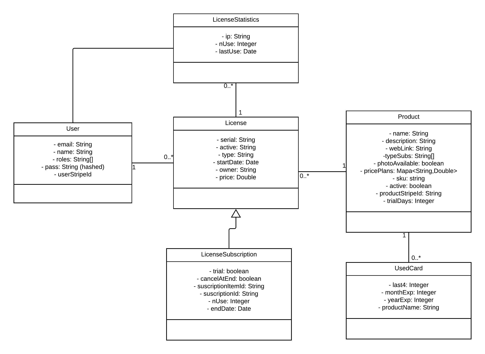

#  Development Guide

## Installation
On this tutorial, we are going to explain how to execute the application with Open Source tools: Eclipse Spring Tool Suite 3 and Visual Studio Code. You can use others if you want to.
**Pre-requisites:** Java and MySQL server installed on your machine.

[ *Tutorial to install MySQL (in Spanish) step by step*](https://www.profesionalreview.com/2018/12/13/mysql-windows-10/)

**First of all**, download the last version of the Licensoft repository.
### (JAVA BACK-END)
1. Download [Spring Tool Suite 3](https://spring.io/tools3/sts/all).
2. Open backend folder on STS.
3. [Set the properties](#setting-properties-backend)
4. Run as Spring Boot application.

You can configure the database url, user and pass on the application.properties.

### (FRONT-END ANGULAR)
 1. Download and install [Node.js and npm](https://nodejs.org/en/)
 2. Download and install Angular CLI: `npm install -g @angular/cli` on the console
 3. Download and install [Visual Studio Code](https://code.visualstudio.com/)
 4. Open Angular project on your IDE(Frontend folder)
 5. [Set the proxy properties](#setting-properties-frontend)
 6. Run `npm install` and then, `ng serve --proxy-config proxy.conf.json`. The app will be running on http://localhost:4200

## Setting the properties

### BACKEND <a name="setting-properties-backend"></a>
On the `application.properties` file inside the backend folder (src/main/resources).
**Example** `application.properties`
```
spring.datasource.url=jdbc:mysql://localhost/nameOfYourScheme?useUnicode=true&useJDBCCompliantTimezoneShift=true&useLegacyDatetimeCode=false&serverTimezone=UC
spring.datasource.username=root
spring.datasource.password=passOfYourMySQLConnection
spring.jpa.hibernate.ddl-auto=update

stripe.privateKey=sk_***
stripe.publicKey=pk_***
appName=LicenSoft
app.domain=http://localhost:4200/#
adminEmail=***@email.com
adminName=***
adminPass=***

# Must be Gmail
spring.mail.username=***@gmail.com
spring.mail.password=***

# Next 4 properties can't be changed
spring.mail.host=smtp.gmail.com
spring.mail.port=587
spring.mail.properties.mail.smtp.auth=true
spring.mail.properties.mail.smtp.starttls.enable=true

# 8443 for HTTPS, 80 for HTTP.
server.port=8443/80

# [Only if HTTPS]Best path: src/main/resources (classpath)
server.ssl.key-store=classpath:keystore.jks 

# [Only if HTTPS] Password and Secret for the default selfsigned certificate by the author
server.ssl.key-store-password=password
server.ssl.key-password=secret

# Path of the private.key for RSA algorithm
licencheck.keys.private=.../private.key

```

### FRONTEND <a name="setting-properties-frontend"></a>
We use a proxy.conf.js file to redirect all the requests made to **/api/*** to the URL of the backend (it will vary depending if backend is deployed under http or https).
 **proxy.conf.js** for HTTP:
```
{
	"/api/*": {
		"target": "http://localhost:80/",
		"secure": false,
		"changeOrigin": true,
		"logLevel": "debug"
	}
}
```
 **proxy.conf.js** for HTTPS:
```
{
	"/api/*": {
		"target": "https://localhost:8443/",
		"secure": true,
		"changeOrigin": true,
		"logLevel": "debug"
	}
}
```
## Inside the app
### DOMAIN
####  Product
* Name (String)
* Description (String)
* WebLink (String)
* Licenses  (License[])
* TypeSubs (String[]) 
* PhotoAvailable (boolean)
* PlansPrices (Map<String, Number>)
* Plans (Map<String,String>)
* Sku (String)
* Active (boolean)
* ProductStripeId (String)
* TrialDays (int)

#### License
* Serial (String)
* Active (boolean)
* Type (String)
* Product
* StartDate (Date)
* Owner (String)
* Price (double)

### #License Subscription
* Trial (boolean)
* CancelAtEnd (boolean)
* SubscriptionItemId (String)
* SubscriptionId (String)
* NUsage (int)
* EndDate (Date)

### License Statistics
Object with statistics of a License (by ip)
* License (License)
* Ip (String)
* NUsage (int)
* LastUsage (Date)


#### User
* Email (String)
* Name (String)
* Roles (String[])
* Password (String - hashed)
* UserStripeId (String)

#### Used Card
*	Last4 (int)
*	ExpMonth (int)
*	ExpYear (int)
*	ProductName (String)

