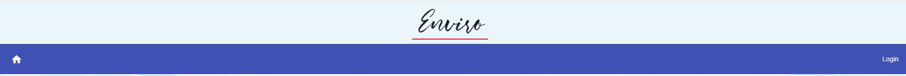

# INSTALLATION GUIDE - Production
Licensoft offers 2 Docker Images to deploy the application easily:
 * **licensoft** : runs under **HTTPS** on port 8443. Needs a SSL certificate (we provide a self-signed one and it will be explained how to make an own self-signed).
 * **licensoft-http**: runs under **HTTP** on port 80.

Both images need to be *paired* with a SQL Docker Container, so we provide a docker-compose.yml that will make them work together. This file will vary on some of its enviroment variables (properties) depending if the chosen image of Licensoft is HTTP or HTTPS.

LicenSoft includes **Mail sending** , **Stripe Integration**, **RSA cryptography** for signing offline Licenses, and **Custom naming** of the app. It is also needed to configure an **Admin Account**. For a correct configuration, some properties must be setted before running the code. 

## Setting the properties 
Inside the docker folder, a `.env` file must be placed next to the `docker-compose.yml` with the structure **key=value**. Last one will get the environment variables needed from the `.env`.

*Example `.env`:* 
* **Custom naming** 
	* APPNAME=Licensoft
	* APPDOMAIN=http://licensoft.es
* **Stripe**
	* STRIPE_PRIVATEKEY=sk_***
	* STRIPE_PUBLICKEY=pk***
* **Admin Account**
	* ADMINEMAIL=xxxx@xxxx.com
	* ADMINNAME=xxx
	* ADMINPASS=********
* **Email Sending (GMAIL)**
	*  SPRING_MAIL_USERNAME=xxxxx@gmail.com
	*	SPRING_MAIL_PASSWORD=*****
	*	SPRING_MAIL_PROPERTIES_MAIL_SMTP_AUTH="true" (*DON'T CHANGE*)
	*	SPRING_MAIL_PROPERTIES_MAIL_SMTP_STARTTLS_ENABLE="true"  (*DON'T CHANGE*)
* **RSA Private Key Path**
	* LICENCHECK_KEYS_PRIVATE=/keys/private.key
 * **[IF IMAGE SELECTED IS *licensoft*] SSL (HTTPS) *(This example is valid for the default selfsigned certificate by the author)***
	* SSLKEYSTORE=/certs/keystore.jks
	* SSLKEYSTOREPASS=password 
	* SSLKEYPASS=secret

## Where to get the properties
* **Custom naming:**  This will be the name of your Web (the name will be shown on the header) and the domain where the web application will be deployed (including http:// or https://).

* **Stripe:** Private and Public keys needed. Visit [Stripe Integration](./StripeIntegration.md#first-steps-:-creating-a-stripe-account) to know how to get them.

* **Admin Account:** A unique Admin Account is created with the email, name and pass specified. It's not possible to create any new Admin Account.

* **Email Sending (GMAIL):** Emails are sent when registering, indicating the credentials created. This email will be sent with the indicated account (must be Gmail). It's necessary to set the password of the account too.

* **RSA Private Key Path**: The path where your private key used to sign the Licenses is placed. We offer a private.key that is paired with its Public Key that works by default in Licencheck, placed in `docker/keys`. 

* **[IF IMAGE SELECTED IS *licensoft*] SSL (HTTPS):** A `.jks` file it's necessary to run the application under HTTPS. By default, there is a selfsigned certificate. 
To create a **new selfsigned credential** you must follow next steps:
	1. Open your Shell.
	2. `cd $JAVA_HOME/bin`
	3. Run `keytool -genkey -keyalg RSA -alias selfsigned -keystore path/to/docker/certs/keystore.jks -storepass yourPass -validity 360 -keysize 2048`
	4. Answer the questions that will be shown.
	5. The last one will be your **key password**. 
Once this is done, properties needed will be:
	* Parameter passed in -storepass (in this case, "**yourPass**")
	* The **key password** introduced.
	*  The **path** where the `.jks` is placed: **must** be inside `docker/certs/`
	
 ## RUNNING THE APP (DOCKER) 
**Pre-requisites:**
 1. Install [Docker Desktop](https://hub.docker.com/editions/community/docker-ce-desktop-windows)
 2. Download last GitHub version of the project.

---
1. Open your Shell and go to the docker folder of the project.
2. Run `docker-compose up`. The application backend will be running on port 80 (image = licensoft-http) under HTTP or on port 8443 (image = licensoft) under HTTPS.