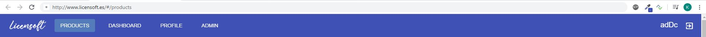

# INSTALATION GUIDE 
LicenSoft includes **Mail sending** , **Stripe Integration**, **Custom naming** of the app and **SSL for HttpS**. It is also needed to configure an **Admin Account**. For a correct configuration, some properties must be setted before running the code. 
## Where to get the properties
* **Custom naming:**  This will be the name of your Web (the name will be shown on the header)


* **Stripe:** Private and Public keys needed. Visit [Stripe Integration](./StripeIntegration.md#first-steps-:-creating-a-stripe-account) to know how to get them.

* **Admin Account:** A unique Admin Account is created with the email, name and pass specified. It's not possible to create any new Admin Account.

* **Email Sending (GMAIL):** Emails are sent when registering, indicating the credentials created. This email will be sent with the indicated account (must be Gmail). It's necessary to set the password of the account too.

* **SSL (HTTPS):** A `.jks` file it's necessary to run the application under HTTPs. By default, there is a selfsigned certificate. 
To create a **new selfsigned credential** you must follow next steps:
	1. Open your Shell.
	2. `cd $JAVA_HOME/bin`
	3. Run `keytool -genkey -keyalg RSA -alias selfsigned -keystore path/to/docker/certs/keystore.jks -storepass yourPass -validity 360 -keysize 2048`
	4. Answer the questions that will be shown.
	5. The last one will be your **key password**. 
Once this is done, properties needed will be:
	* Parameter passed in -storepass (in this case, "**yourPass**")
	* The **key password** introduced.
	*  The **path** where the `.jks` is placed: **must** be inside `docker/certs/`
	

## Setting the properties 
a)  **DEVELOPMENT:** On the `application.properties` file inside the backend folder (src/main/resources).
*Example `application.properties`
```
spring.datasource.url=jdbc:mysql://localhost/nameOfYourScheme?useUnicode=true&useJDBCCompliantTimezoneShift=true&useLegacyDatetimeCode=false&serverTimezone=UC
spring.datasource.username=root
spring.datasource.password=passOfYourMySQLConnection
spring.jpa.hibernate.ddl-auto=update

stripe.privateKey=sk_***
stripe.publicKey=pk_***
appName=LicenSoft
adminEmail=***@email.com
adminName=***
adminPass=***

spring.mail.username=***@gmail.com
spring.mail.password=***

# Next 4 properties can't be changed
spring.mail.host=smtp.gmail.com
spring.mail.port=587
spring.mail.properties.mail.smtp.auth=true
spring.mail.properties.mail.smtp.starttls.enable=true

# Do not change (port for https)
server.port=8443

# Best path: src/main/resources (classpath)
server.ssl.key-store=classpath:keystore.jks 

# Password and Secret for the default selfsigned certificate by the author
server.ssl.key-store-password=password
server.ssl.key-password=secret
```


b) **DOCKER (PROD):** Inside the docker folder, a `.env` file must be placed next to the `docker-compose.yml`. Last one will get the environment variables needed from the `.env`.

*Example `.env`:* 
* **Custom naming** 
	* APPNAME=NameTestApp
* **Stripe**
	* STRIPE_PRIVATEKEY=sk_***
	* STRIPE_PUBLICKEY=pk***
* **Admin Account**
	* ADMINEMAIL=xxxx@xxxx.com
	* ADMINNAME=xxx
	* ADMINPASS=********
* **Email Sending (GMAIL)**
	*  SPRING_MAIL_USERNAME=xxxxx@gmail.com
	*	SPRING_MAIL_PASSWORD=*****
	*	SPRING_MAIL_PROPERTIES_MAIL_SMTP_AUTH="true" (*DON'T CHANGE*)
	*	SPRING_MAIL_PROPERTIES_MAIL_SMTP_STARTTLS_ENABLE="true"  (*DON'T CHANGE*)
* **SSL (HTTPS) *(This example is valid for the default selfsigned certificate by the author)***
	* SSLKEYSTORE=/certs/keystore.jks
	* SSLKEYSTOREPASS=password 
	* SSLKEYPASS=secret


## FOR DEVELOPMENT
On this tutorial, we are going to explain how to execute the application with Open Source tools: Eclipse Spring Tool Suite 3 and Visual Studio Code. You can use others if you want to.
**Pre-requisites:** Java and MySQL server installed on your machine.

[ *Tutorial to install MySQL (in Spanish) step by step*](https://www.profesionalreview.com/2018/12/13/mysql-windows-10/)

### (JAVA BACK-END)
1. Download [Spring Tool Suite 3](https://spring.io/tools3/sts/all).
2. Open backend folder on STS.
3. Run as Spring Boot application.

You can configure the database url, user and pass on the application.properties.

### (FRONT-END ANGULAR)
 1. Download and install [Node.js and npm](https://nodejs.org/en/)
 2. Download and install Angular CLI: `npm install -g @angular/cli` on the console
 3. Download and install [Visual Studio Code](https://code.visualstudio.com/)
 4. Open Angular project on your IDE(Frontend folder)
 5. Set your Public Stripe Key on file src/environments/environment.ts
 6. Run `npm install` and after, `ng serve`. The app will be running on http://localhost:4200


 ## RUNNING THE APP (DOCKER) - NOT DEVELOPMENT
**Pre-requisites:**
 1. Install [Docker Desktop](https://hub.docker.com/editions/community/docker-ce-desktop-windows)
 2. Download last GitHub version of the project.

---
1. Open your Shell and go to the docker folder.
2. Run `docker-compose up`. The application backend will be running on port 8443 under https.
