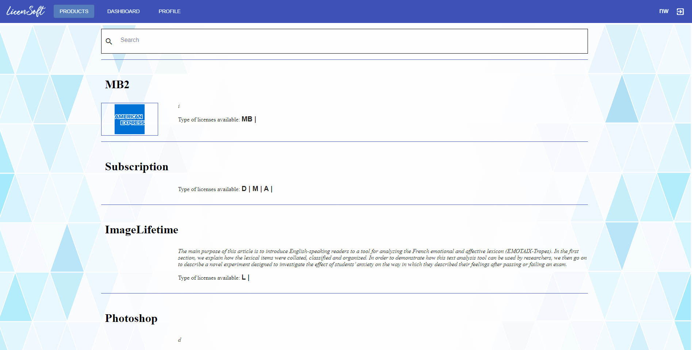

## INDEX
* [Roles](#roles)
* [ADMIN Habilities](#admin-habilities)
    * [Add Product - Subscription](#add-product-subs) 
    * [Add Product - Lifetime](#add-product-lifetime)
    * [Add Product - Mettered Billing](#add-product-mb)
    * [Edit-Delete Product](#edit-&-delete-product)
    * [See Product Statistics](#see-product-statistics)
* [USER normal flow](#user-normal-flow)
	1. [Login-Register](#login-register)
	2. [Search in catalog](#search-in-catalog)
	3. [Payment source management of User Profile](#payment-source-management-of-user-profile)
	4. [Subscribe to Product](#subscribe-to-product)
	5. [Subscribe to a Free Trial](#subscribe-to-a-free-trial)
	6. [Buy Lifetime Product](#buy-lifetime-product)
	7. [See License Statistics](#see-license-statistics)
	8. [Introduce license Serial into purchased software ](#introduce-license-serial-into-the-purchased-software)

 

## ROLES
In Licensoft there are 2 types of roles: **ADMIN** and **USER**. 
	**ADMIN-->** (Unique) The seller. It will be able to post, update and delete new Products, and see statistics of them.  
	**USER-->** The customer. It will be able to see all the products and purchase/subscribe to them and get the Licenses. It will be able to see the statistics of the Licenses that it owns.

## ADMIN Habilities
### Add Product - Subscription type 

---

### Add Product - Lifetime type 
This flow is the same as Adding a subscription type but changing its type.

---

### Add Product - Mettered Billing(Subscription) type 
This flow is the same as Adding a subscription type (MB is a type of Subscription).

---

### Edit & Delete Product
Admin can change URL and description of a Product. To edit other parameters admin should add a new product. 
The delete will set the product to inactive and it will disappear from the catalog, but active licenses of it will still be active.

---

### See Product Statistics
Admin can see statistics by Serial and by Owner about their usages (graphs and lists).
Admin can click on one Serial to see more statistics about that License.

## USER normal Flow
### Login-Register
Users should be logged to interact. 
An email will be sent to the user with the credentials when registered (can take some seconds).

---

### Search in catalog
Users can search for products which name matches with the text introduced.

---

### Payment source management of User Profile
User can set new Cards (Payment Sources) for future subscriptions. 
The last one introduced will be automatically setted to "Default", but user can change it to other card.
Cards can be deleted.

---
## Payments
License will be delivered after payment to the user in 2 forms:
	- Serial (If product is Online/Both)
	- LicenseFile (If product is Offline/Both)
	
### Subscribe to Product
Users can subscribe to a Product selecting which plan they want.
Before purchasing, user can select the card to pay.

	

---

### Get a Free Trial
Users can get a Free Trial of a product if the seller has activated it.
Users can only get one Free Trial for a Product with each card introduced. So, Users must introduce the card before the subscription to check if that card has been used previously to get it.
Users must select the Subscription Type that will be bought when Trial finishes, if the user hasn't disabled the automatic renewal.

---

### Buy Lifetime Product
User must introduce a card to pay a Lifetime Product. This card won't be saved in the User Profile.

---

### Buy Product with 3DSecure Card
Some cards require an authentication process (depending of each bank). Licensoft is prepared for this, so when a card needs the 3DSecure authentication, it redirects to the bank page to do the authentication needed, and if it's correct, returns to the product's page with the Payment Successful message.
This is prepared for all payments: Lifetime and Subscriptions.

---

### See License Statistics
User can see Statistics of the licenses previously purchased, by IP, Name, and IP&Name.
User can check license statistics from the actual period and the previous period.

If User clicks on a license of the pie-chart, a bar-chart can be seen about usage by hours (daily), days (monthly), or months (annual).

### Introduce license Serial into the purchased software (Online Checking)

---
